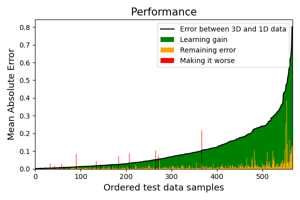

# A multidimensional AI-trained correction term for the 1D approximation with Gaussian process regression for Airborne TDEM data

**_More details can be found in the manuscript (https://arxiv.org/abs/2311.13998 or https://doi.org/10.1016/j.cageo.2024.105602), published in Computers & Geosciences._**


Full 3D inversion of time-domain electromagnetic data requires immense computational resources. To overcome the time-consuming 3D simulations, we propose a surrogate model trained on 3D simulation data and predicts the approximate output much faster. We exemplify the approach for two-layered models.

We construct a surrogate model that predicts the discrepancy between a 1D two-layered subsurface model (low fidelity data, LF) and a deviation of the 1D assumption (high fidelity data, HF).
```math 
RE = (HF - LF)/(LF)
```
The LF data is efficiently computed with a semi-analytical 1D forward model. The HF data is generated with, e.g., SimPEG (https://simpeg.xyz/).

The results are encouraging even with few training samples, but obtaining a high accuracy requires more data. We view the performance as a learning gain, representing the gain from the surrogate model while acknowledging a residual discrepancy. 



## Intended use
The code model.py describes the step-by-step process in constructing a relative error correction term for replacing expensive 3D modelling
1. Reading the data (parameters `X` (describing the subsurface model), `LF` (1D approximation), `HF` (3D simulations))
2. The proposed data transformations (standardizations, log-like transforms)
3. Conversion to relative error and splitting the data into a training and test dataset
4. Dimensionality reduction by (1) Functional Data Analysis followed by (2) Principal Component Analysis
5. Training the surrogate models (one for each principal component)
6. The wrapper `make_prediction` is used to make predictions. It has a built-in warning that warns the end-users if the supplied parameters (about the subsurface model) are outside the trusted parameter space. 
7. An example is shown at the bottom

## How to cite
The method:

Deleersnyder, W., Dudal, D., & Hermans, T. (2024). A multidimensional AI-trained correction to the 1D approximate model for Airborne TDEM sensing. Computers & Geosciences, 188, 105602.
